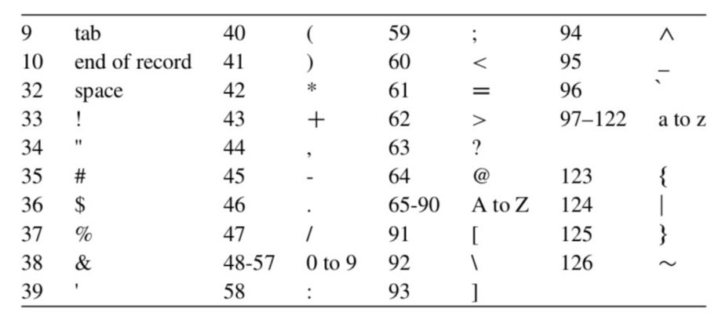

# Exercice 1: Majuscule à minuscule
```
Exemple:
Lisez une chaîne de caractères, se termine par *, et affichez la valeur ASCII de chaque caractère à l’écran.

• Le code d’ASCII de * est 42.
readin:-get0(X),process(X).
process(42).
process(X):-X=\=42,write(X),nl,readin.
```

 

10 : end of record(finit)


# Exercice 2:
1. Écrivez un programme Prolog qui permet de créer un fichier
sortieavecformat.txt contenant les lignes suivantes:
    ```
            un
        deux  trois
    quatre  cinq  six
    ```

- Vous pouvez utiliser ces prédicats pré-definis: open/3 , close/1 , tab/2 , nl/1 , et write/2.

2. Écrivez un programme Prolog qui lit dans un fichier texte mot par mot, affiche chaque mot sur une ligne.

3. **Écrivez un programme Prolog qui lit dans un fichier texte mot par mot, et affiche tous les mots lus et leur fréquence (sépérateurs: espace, virgule, point)

***Si vous faites l'exercice 3, vous obtenez un bonus.***